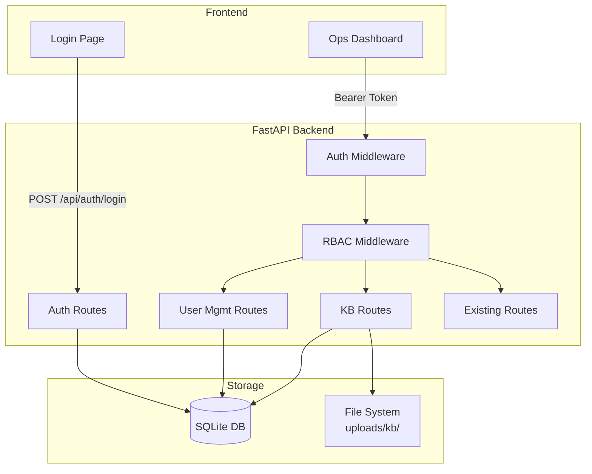

# Design Document: auth-rbac-ui-redesign

## Overview

This design introduces authentication, role-based access control (RBAC), knowledge base document management, and a UI overhaul to the Multi-Cloud AIOps Platform. The platform currently exposes all endpoints publicly with no identity or authorization layer.

The solution adds:
- JWT-based authentication with bcrypt password hashing
- Two-role RBAC system (Admin, L1_User) enforced via middleware
- User management and password lifecycle (first-time change, reset)
- Knowledge base document upload/retrieval
- A redesigned frontend with login page, sidebar dashboard, and role-based navigation

All new backend functionality integrates with the existing FastAPI application at `backend/api/main.py` using the project's established router pattern. A new SQLite database handles persistence. The frontend replaces the single-page query form with a multi-page SPA-like experience using vanilla HTML/CSS/JS.

## Architecture



**Request flow:**
1. User authenticates via `/api/auth/login` → receives JWT
2. Subsequent requests include `Authorization: Bearer <token>` header
3. Auth middleware validates token, checks blacklist, extracts user claims
4. RBAC middleware checks user role against endpoint permission requirements
5. Route handler executes business logic

## Components and Interfaces

### Backend Components

| Component | Location | Responsibility |
|-----------|----------|----------------|
| `auth.py` | `backend/api/routes/auth.py` | Login, logout, password reset, first-time change endpoints |
| `users.py` | `backend/api/routes/users.py` | Create user, list users (Admin only) |
| `kb.py` | `backend/api/routes/kb.py` | Upload, list, retrieve KB documents |
| `auth_middleware.py` | `backend/api/middleware/auth_middleware.py` | JWT validation, token blacklist check |
| `rbac.py` | `backend/api/middleware/rbac.py` | Role-based permission enforcement |
| `database.py` | `backend/database.py` | SQLite connection, table initialization |
| `models.py` | `backend/models.py` | Pydantic models for request/response and DB row mappings |
| `security.py` | `backend/security.py` | JWT encode/decode, bcrypt hash/verify, password policy, rate limiter |

### Frontend Components

| Component | Location | Responsibility |
|-----------|----------|----------------|
| `login.html` | `frontend/aiops/login.html` | Login page with form and validation |
| `dashboard.html` | `frontend/aiops/dashboard.html` | Ops dashboard with sidebar layout |
| `auth.js` | `frontend/aiops/auth.js` | Token storage, auth state, redirect logic |
| `dashboard.js` | `frontend/aiops/dashboard.js` | Sidebar navigation, role-based rendering, section loading |
| `styles.css` | `frontend/aiops/styles.css` | Updated styles with new color palette |

### Key Interfaces

**Auth Routes:**
```
POST /api/auth/login         → { access_token, role, requires_password_change }
POST /api/auth/logout        → { message }
POST /api/auth/reset-request → { reset_token }  (simplified — no email)
POST /api/auth/reset         → { message }
POST /api/auth/change-password → { access_token, role }
```

**User Management Routes:**
```
POST /api/users              → { user }        (Admin only)
GET  /api/users              → { users[] }     (Admin only)
```

**KB Routes:**
```
POST /api/kb/documents       → { document_id } (Admin only)
GET  /api/kb/documents       → { documents[] } (Authenticated)
GET  /api/kb/documents/{id}  → file download   (Authenticated)
```

### Dependency Additions

New packages to add to `backend/requirements.txt`:
- `python-jose[cryptography]==3.3.0` — JWT encoding/decoding
- `passlib[bcrypt]==1.7.4` — bcrypt password hashing
- `python-multipart==0.0.9` — file upload handling
- `aiosqlite==0.20.0` — async SQLite access

## Data Models

### Database Schema (SQLite)

```sql
CREATE TABLE users (
    id INTEGER PRIMARY KEY AUTOINCREMENT,
    username TEXT UNIQUE NOT NULL,
    password_hash TEXT NOT NULL,
    role TEXT NOT NULL CHECK(role IN ('Admin', 'L1_User')),
    first_time_flag BOOLEAN NOT NULL DEFAULT 1,
    created_at TEXT NOT NULL DEFAULT (datetime('now'))
);

CREATE TABLE reset_tokens (
    id INTEGER PRIMARY KEY AUTOINCREMENT,
    username TEXT NOT NULL,
    token TEXT UNIQUE NOT NULL,
    expires_at TEXT NOT NULL,
    used BOOLEAN NOT NULL DEFAULT 0,
    FOREIGN KEY (username) REFERENCES users(username)
);

CREATE TABLE kb_documents (
    id INTEGER PRIMARY KEY AUTOINCREMENT,
    title TEXT NOT NULL,
    filename TEXT NOT NULL,
    file_path TEXT NOT NULL,
    content_type TEXT NOT NULL,
    file_size INTEGER NOT NULL,
    uploaded_by TEXT NOT NULL,
    uploaded_at TEXT NOT NULL DEFAULT (datetime('now')),
    FOREIGN KEY (uploaded_by) REFERENCES users(username)
);

CREATE TABLE token_blacklist (
    id INTEGER PRIMARY KEY AUTOINCREMENT,
    jti TEXT UNIQUE NOT NULL,
    expires_at TEXT NOT NULL
);

CREATE TABLE login_attempts (
    id INTEGER PRIMARY KEY AUTOINCREMENT,
    username TEXT NOT NULL,
    attempted_at TEXT NOT NULL DEFAULT (datetime('now')),
    success BOOLEAN NOT NULL DEFAULT 0
);
```

### Pydantic Models

```python
# Request models
class LoginRequest(BaseModel):
    username: str = Field(..., min_length=1, max_length=50)
    password: str = Field(..., min_length=1)

class CreateUserRequest(BaseModel):
    username: str = Field(..., min_length=3, max_length=50, pattern=r'^[a-zA-Z0-9_]+$')
    password: str = Field(..., min_length=8)
    role: Literal['Admin', 'L1_User']

class PasswordResetRequest(BaseModel):
    username: str = Field(..., min_length=1)

class PasswordResetConfirm(BaseModel):
    token: str = Field(..., min_length=1)
    new_password: str = Field(..., min_length=8)

class ChangePasswordRequest(BaseModel):
    current_password: str = Field(..., min_length=1)
    new_password: str = Field(..., min_length=8)

# Response models
class LoginResponse(BaseModel):
    access_token: str
    role: str
    requires_password_change: bool

class UserResponse(BaseModel):
    username: str
    role: str
    created_at: str

class KBDocumentMeta(BaseModel):
    id: int
    title: str
    filename: str
    content_type: str
    file_size: int
    uploaded_by: str
    uploaded_at: str
```

### JWT Payload Structure

```json
{
  "sub": "username",
  "role": "Admin",
  "first_time": false,
  "jti": "unique-token-id",
  "exp": 1700000000
}
```

## Correctness Properties

*A property is a characteristic or behavior that should hold true across all valid executions of a system — essentially, a formal statement about what the system should do. Properties serve as the bridge between human-readable specifications and machine-verifiable correctness guarantees.*

### Property 1: JWT Issuance Correctness

*For any* valid user with credentials (username, password) where the password matches the stored hash, the Auth_Service SHALL return a JWT token that contains the correct `sub` (username), `role`, and an `exp` claim exactly 60 minutes from issuance time.

**Validates: Requirements 1.1, 1.5**

### Property 2: Password Hashing Strength

*For any* password string provided during user creation or password change, the resulting stored hash SHALL be a valid bcrypt hash with a work factor of at least 12.

**Validates: Requirements 1.3**

### Property 3: Invalid Credentials Rejection

*For any* username/password pair where the password does not match the stored hash for that username (or the username does not exist), the Auth_Service SHALL return a 401 status code.

**Validates: Requirements 1.2**

### Property 4: Rate Limiter Threshold Enforcement

*For any* sequence of login attempts for a single username, if the number of failed attempts within a 15-minute window exceeds 5, all subsequent attempts within that window SHALL be rejected with a 429 status code regardless of credential validity.

**Validates: Requirements 1.4**

### Property 5: Blacklisted Token Rejection

*For any* JWT token whose `jti` exists in the token blacklist and has not expired from the blacklist, the Auth Middleware SHALL reject the request with a 401 status code.

**Validates: Requirements 2.2**

### Property 6: Reset Token Single-Use Invariant

*For any* reset token, once it has been successfully used to change a password OR its 30-minute expiry has elapsed, all subsequent attempts to use that token SHALL be rejected with a 400 status code and the message "Reset token is invalid or expired".

**Validates: Requirements 3.2, 3.3**

### Property 7: Password Policy Validation

*For any* string, the password policy validator SHALL accept it if and only if it contains at least 8 characters AND at least one uppercase letter AND at least one lowercase letter AND at least one digit AND at least one special character. All other strings SHALL be rejected.

**Validates: Requirements 3.4**

### Property 8: RBAC Permission Matrix

*For any* request to a protected endpoint, given a user's role and first_time_flag status, the RBAC_Service SHALL:
- Return 401 if no valid token is present
- Return 403 if the user's role is not permitted for that endpoint
- Restrict first-time users (first_time_flag=true) to only the password-change endpoint
- Permit Admin users access to all endpoints
- Restrict L1_User to KB read endpoints only
- Reject any role value not in {Admin, L1_User}

**Validates: Requirements 4.3, 5.1, 5.2, 5.3, 5.4, 5.5, 5.6, 6.4**

### Property 9: New User First-Time Flag Invariant

*For any* user created via the User_Management_Service, the resulting user record SHALL have `first_time_flag` set to true, regardless of the role assigned.

**Validates: Requirements 6.1**

### Property 10: Username Uniqueness Enforcement

*For any* create-user request where the username already exists in the database, the User_Management_Service SHALL return a 409 Conflict response, and the existing user record SHALL remain unchanged.

**Validates: Requirements 6.2**

### Property 11: KB Document Upload Round-Trip

*For any* valid document uploaded by an Admin (valid type, size ≤ 10 MB), retrieving that document by its returned identifier SHALL yield the identical file content, and the stored metadata SHALL contain the correct uploader username and a valid upload timestamp.

**Validates: Requirements 7.1, 7.4, 8.2**

### Property 12: KB Document List Completeness

*For any* set of documents uploaded to the system, the list endpoint SHALL return exactly that set with each entry containing title, upload date, and uploader name. Similarly, the user list endpoint SHALL return all created users with username, role, and creation timestamp.

**Validates: Requirements 6.3, 8.1**

### Property 13: KB File Type and Size Validation

*For any* file upload attempt, the KB_Service SHALL accept the file if and only if its content type is one of {PDF, DOCX, plain text} AND its size is ≤ 10 MB. Files exceeding 10 MB SHALL be rejected with 413. Files with unsupported types SHALL be rejected with 415.

**Validates: Requirements 7.2, 7.3**

### Property 14: Non-Existent Resource Returns 404

*For any* document identifier that does not exist in the KB database, a retrieval request SHALL return a 404 status code.

**Validates: Requirements 8.3**

## Error Handling

### HTTP Status Codes

| Code | Usage |
|------|-------|
| 200 | Successful operation |
| 201 | Resource created (user, document) |
| 400 | Invalid reset token, password policy failure |
| 401 | Invalid credentials, expired/blacklisted token |
| 403 | Role-based access denied |
| 404 | Resource not found |
| 409 | Username conflict |
| 413 | File too large (>10 MB) |
| 415 | Unsupported file type |
| 422 | Request validation failure |
| 429 | Rate limit exceeded |

### Error Response Envelope

All errors follow the existing project convention:
```json
{
  "status": "error",
  "data": null,
  "error": {
    "message": "Human-readable error description"
  }
}
```

### Rate Limiting Strategy

Rate limiting for login attempts uses an in-memory counter backed by the `login_attempts` table:
- Track failed attempts per username in a rolling 15-minute window
- After 5 failures, reject with 429 until the window expires
- Successful login resets the window for that username
- On server restart, state is reconstructed from the database

### Token Blacklist Cleanup

A background task runs periodically (every 30 minutes) to purge expired entries from `token_blacklist`, preventing unbounded table growth.

## Testing Strategy

### Unit Tests

Unit tests verify specific behavior with concrete examples:
- Login with valid/invalid credentials
- Password policy acceptance/rejection for specific strings
- RBAC permission checks for each role-endpoint combination
- Rate limiter threshold behavior
- File upload size/type validation
- JWT creation and validation with known payloads
- First-time login flag flow

### Property-Based Tests

Property-based testing is applicable to this feature. The authentication, password validation, and RBAC logic involve pure functions with clear input/output behavior and universal invariants across large input spaces.

**Library:** `hypothesis` (already in project dependencies)

**Configuration:**
- Minimum 100 examples per property test
- Each test references its correctness property from this design document
- Tag format: `Feature: auth-rbac-ui-redesign, Property {N}: {description}`

Properties to test:
- Password policy validation (universal across all strings)
- JWT encode/decode round-trip (all valid payloads)
- RBAC permission matrix (all role/endpoint combinations)
- Token blacklist exclusion (all blacklisted tokens are rejected)
- Rate limiter invariants (threshold always enforced)

### Integration Tests

Integration tests cover the full request lifecycle:
- End-to-end login → token → protected endpoint flow
- File upload → list → download cycle
- User creation → first-time login → password change → normal access
- Token expiry and blacklist enforcement across requests

### Test Location

All tests live in `tests/` directory following existing project convention:
- `tests/test_auth.py` — authentication endpoints
- `tests/test_rbac.py` — RBAC middleware
- `tests/test_password.py` — password policy and reset flow
- `tests/test_kb.py` — KB document operations
- `tests/test_users.py` — user management
- `tests/test_properties.py` — property-based tests
