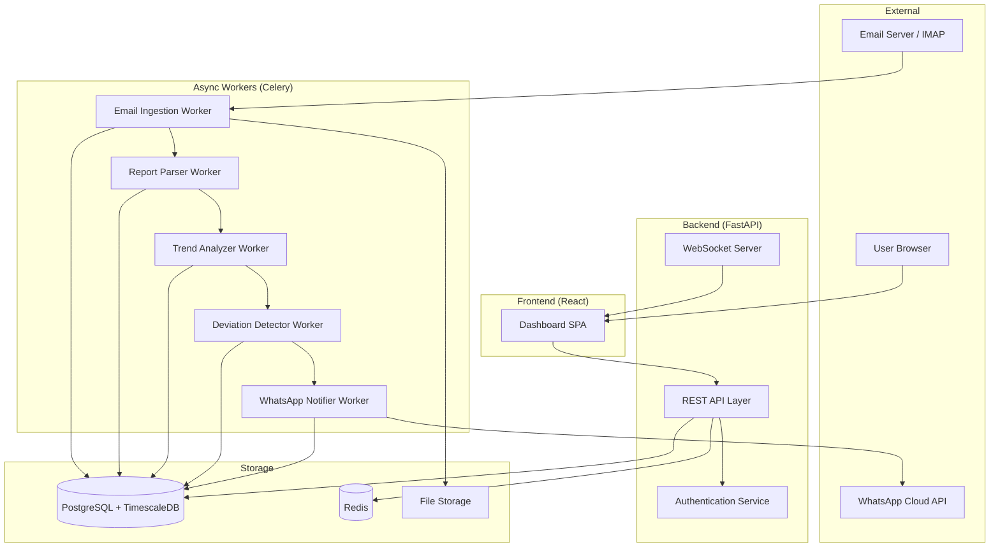
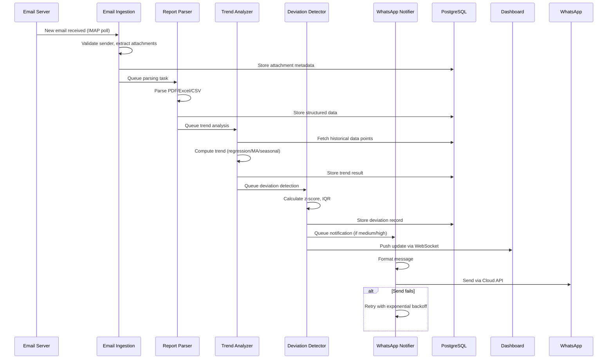
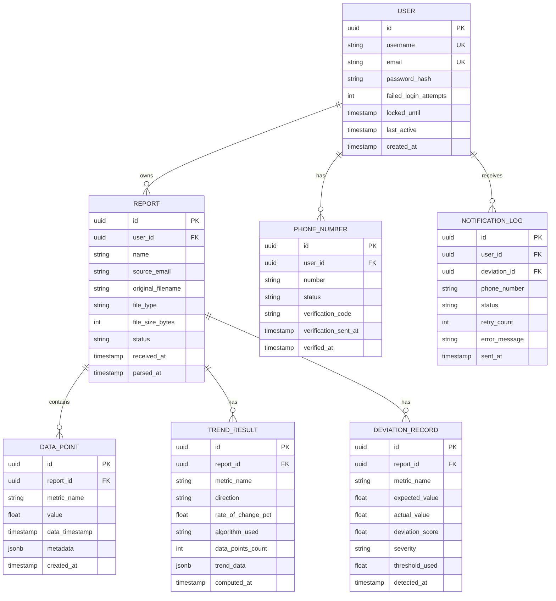

# Design Document: Email Report Analysis

## Overview

This document describes the technical design for an AI-powered web application that ingests reports via email attachments (PDF, Excel, CSV), analyzes trends using open-source ML algorithms, detects statistical deviations, and sends WhatsApp alerts for anomalies. The system includes user authentication and a dashboard for visualizing trends by report name.

The architecture prioritizes open-source tooling: scikit-learn and statsmodels for trend analysis, PyOD for anomaly detection, pdfplumber/openpyxl for document parsing, and the WhatsApp Cloud API for notifications. The backend is Python-based (FastAPI), with a React frontend for the dashboard.

### Key Design Decisions

| Decision | Choice | Rationale |
|----------|--------|-----------|
| Backend Framework | FastAPI (Python) | Async support, native ML ecosystem, type safety |
| ML/Trend Analysis | scikit-learn + statsmodels | Mature, well-documented open-source libraries |
| Anomaly Detection | PyOD + scipy.stats | Comprehensive outlier detection, z-score/IQR built-in |
| PDF Parsing | pdfplumber | Active development, table extraction, open-source |
| Excel Parsing | openpyxl | Standard Python library for .xlsx, resolves formulas |
| Email Ingestion | IMAP polling via imapclient | Open protocol, no vendor lock-in |
| WhatsApp | Meta WhatsApp Cloud API | Official API, free tier available, Python SDK |
| Database | PostgreSQL + TimescaleDB | Time-series optimized, open-source |
| Task Queue | Celery + Redis | Async processing for report analysis pipeline |
| Frontend | React + Chart.js | Interactive dashboards, real-time updates via WebSocket |
| Auth | JWT + bcrypt | Stateless sessions, industry-standard hashing |

## Architecture

### High-Level Architecture Diagram



### System Flow



### Architectural Layers

1. **Presentation Layer** — React SPA with Chart.js for trend visualization, WebSocket for real-time updates
2. **API Layer** — FastAPI REST endpoints for auth, dashboard data, settings management
3. **Processing Layer** — Celery workers handling the async pipeline (ingest → parse → analyze → detect → notify)
4. **Data Layer** — PostgreSQL with TimescaleDB extension for time-series data, Redis for caching and task queue
5. **Integration Layer** — IMAP client for email, WhatsApp Cloud API for notifications

## Components and Interfaces

### 1. Email Ingestion Service

**Responsibility:** Poll IMAP mailbox, validate senders, extract supported attachments, route to parsing pipeline.

```python
class EmailIngestionService:
    """Polls IMAP mailbox and processes incoming emails with report attachments."""

    SUPPORTED_EXTENSIONS = {".pdf", ".xlsx", ".xls", ".csv"}
    MAX_ATTACHMENT_SIZE_MB = 25

    async def poll_mailbox(self) -> list[EmailMessage]:
        """Connect to IMAP server and fetch unread emails."""
        ...

    async def process_email(self, email: EmailMessage) -> IngestionResult:
        """
        Validate sender, extract supported attachments, queue for parsing.
        Returns IngestionResult with processed/skipped attachment counts.
        """
        ...

    def is_registered_sender(self, sender_email: str) -> Optional[User]:
        """Look up sender in registered users table."""
        ...

    def filter_attachments(self, attachments: list[Attachment]) -> list[Attachment]:
        """Filter to supported extensions under size limit."""
        ...
```

**Interface:**
- Input: IMAP email messages
- Output: `IngestionResult` containing extracted attachments queued for parsing
- Events emitted: `attachment.extracted`, `email.discarded`

### 2. Report Parser

**Responsibility:** Extract structured tabular data from PDF, Excel, and CSV files.

```python
class ReportParser:
    """Extracts structured data from report attachments."""

    MAX_PARSE_SIZE_MB = 50
    PARSE_TIMEOUT_SECONDS = 120

    async def parse(self, attachment: Attachment) -> ParseResult:
        """
        Route to appropriate parser based on file type.
        Returns ParseResult with structured rows/columns.
        """
        ...

    def parse_pdf(self, file_path: str) -> list[DataTable]:
        """Extract tables from PDF using pdfplumber."""
        ...

    def parse_excel(self, file_path: str) -> list[DataTable]:
        """Extract cell values from all sheets using openpyxl."""
        ...

    def parse_csv(self, file_path: str) -> DataTable:
        """Parse CSV with auto-detected delimiter (comma, semicolon, tab)."""
        ...

    def detect_delimiter(self, sample: str) -> str:
        """Auto-detect CSV delimiter from file sample."""
        ...
```

**Interface:**
- Input: `Attachment` (file path + metadata)
- Output: `ParseResult` containing `list[DataTable]`
- Errors: `ParseError` (corrupted), `FileTooLargeError`, `EncryptedFileError`, `NoDataError`

### 3. Trend Analyzer

**Responsibility:** Compute trends over time-series data using open-source ML algorithms.

```python
class TrendAnalyzer:
    """Analyzes trends in report data using ML algorithms."""

    MIN_POINTS_LINEAR = 2
    MIN_POINTS_MOVING_AVG = 3
    MIN_POINTS_SEASONAL = 12

    async def analyze(self, report_name: str, new_data: DataTable) -> Optional[TrendResult]:
        """
        Compare new data against historical points.
        Returns None if fewer than 2 data points exist.
        """
        ...

    def select_algorithm(self, num_points: int) -> list[TrendAlgorithm]:
        """Select applicable algorithms based on available data points."""
        ...

    def linear_regression(self, points: list[DataPoint]) -> TrendResult:
        """Compute trend using scikit-learn LinearRegression."""
        ...

    def moving_average(self, points: list[DataPoint], window: int) -> TrendResult:
        """Compute trend using configurable moving average window (3-12)."""
        ...

    def seasonal_decomposition(self, points: list[DataPoint]) -> TrendResult:
        """Decompose time series using statsmodels seasonal_decompose."""
        ...
```

**Interface:**
- Input: `report_name: str`, `new_data: DataTable`
- Output: `Optional[TrendResult]` (None if < 2 data points)
- Libraries: scikit-learn (LinearRegression), statsmodels (seasonal_decompose), numpy (moving average)

### 4. Deviation Detector

**Responsibility:** Identify statistically significant deviations from established trends.

```python
class DeviationDetector:
    """Detects and classifies deviations from trends."""

    MIN_HISTORICAL_POINTS = 5
    DEFAULT_THRESHOLD_STD = 2.0
    IQR_MULTIPLIER = 1.5

    SEVERITY_THRESHOLDS = {
        "low": (2.0, 2.5),
        "medium": (2.5, 3.5),
        "high": (3.5, float("inf")),
    }

    async def detect(self, trend: TrendResult, latest_point: DataPoint,
                     threshold: float = DEFAULT_THRESHOLD_STD) -> list[DeviationRecord]:
        """
        Evaluate latest data point against trend.
        Returns list of DeviationRecords (one per metric).
        """
        ...

    def compute_zscore(self, value: float, mean: float, std: float) -> float:
        """Calculate z-score for a value against distribution."""
        ...

    def compute_iqr_outlier(self, value: float, q1: float, q3: float) -> bool:
        """Check if value is an outlier using 1.5× IQR method."""
        ...

    def classify_severity(self, deviation_score: float) -> DeviationSeverity:
        """Classify deviation into low/medium/high based on score magnitude."""
        ...
```

**Interface:**
- Input: `TrendResult`, `DataPoint`, configurable threshold (1.0–5.0 std)
- Output: `list[DeviationRecord]` (one per deviating metric)
- Libraries: scipy.stats (zscore), numpy (percentile for IQR)

### 5. WhatsApp Notifier

**Responsibility:** Send deviation alert messages via WhatsApp Cloud API with retry logic.

```python
class WhatsAppNotifier:
    """Sends WhatsApp notifications for detected deviations."""

    MAX_MESSAGE_LENGTH = 4096
    MAX_RETRIES = 3
    INITIAL_BACKOFF_SECONDS = 5

    async def notify(self, deviation: DeviationRecord, user: User) -> NotificationResult:
        """
        Send notification to all verified phone numbers for the user.
        Only sends for medium/high severity deviations.
        """
        ...

    def format_message(self, deviation: DeviationRecord) -> str:
        """Format deviation details into WhatsApp message."""
        ...

    async def send_with_retry(self, phone_number: str, message: str) -> bool:
        """Send message with exponential backoff retry (5s, 10s, 20s)."""
        ...

    def validate_e164(self, phone_number: str) -> bool:
        """Validate phone number against E.164 format."""
        ...
```

**Interface:**
- Input: `DeviationRecord`, `User`
- Output: `NotificationResult` (success/failure per recipient)
- External: Meta WhatsApp Cloud API via `whatsapp-python` SDK

### 6. Authentication Service

**Responsibility:** User registration, login, session management, password security.

```python
class AuthenticationService:
    """Manages user authentication and session lifecycle."""

    MAX_FAILED_ATTEMPTS = 5
    LOCKOUT_WINDOW_MINUTES = 15
    SESSION_TIMEOUT_MINUTES = 30
    BCRYPT_COST_FACTOR = 12

    async def login(self, username: str, password: str) -> AuthResult:
        """Validate credentials, create JWT session."""
        ...

    async def validate_session(self, token: str) -> Optional[User]:
        """Validate JWT token and check session expiry."""
        ...

    def hash_password(self, password: str) -> str:
        """Hash password using bcrypt with cost factor 12."""
        ...

    def validate_password_strength(self, password: str) -> PasswordValidation:
        """Check length (8-128) and complexity requirements."""
        ...

    async def check_rate_limit(self, username: str) -> bool:
        """Check if account is locked due to failed attempts."""
        ...
```

**Interface:**
- Input: Credentials, JWT tokens
- Output: `AuthResult` (session token or error), `User` objects
- Libraries: bcrypt, PyJWT, Redis (rate limiting)

### 7. Dashboard API

**Responsibility:** Serve trend data, deviation records, and user settings to the frontend.

```python
# FastAPI Router
@router.get("/reports")
async def list_reports(user: User = Depends(get_current_user)) -> list[ReportSummary]:
    """List all report names for the authenticated user."""
    ...

@router.get("/reports/{report_name}/trends")
async def get_trends(
    report_name: str,
    start_date: Optional[date] = None,
    end_date: Optional[date] = None,
    user: User = Depends(get_current_user)
) -> TrendResponse:
    """Get trend data with optional date range filter (default: 30 days, max: 365 days)."""
    ...

@router.get("/reports/{report_name}/deviations")
async def get_deviations(report_name: str, user: User = Depends(get_current_user)) -> list[DeviationRecord]:
    """Get all deviation records for a report."""
    ...

@router.websocket("/ws/updates")
async def websocket_updates(websocket: WebSocket, user: User = Depends(get_ws_user)):
    """Push real-time trend/deviation updates to connected clients."""
    ...
```

## Data Models

### Entity Relationship Diagram



### Key Data Structures

```python
from dataclasses import dataclass
from enum import Enum
from datetime import datetime
from typing import Optional
import uuid

class TrendDirection(Enum):
    INCREASING = "increasing"
    DECREASING = "decreasing"
    STABLE = "stable"

class DeviationSeverity(Enum):
    LOW = "low"
    MEDIUM = "medium"
    HIGH = "high"

class PhoneNumberStatus(Enum):
    PENDING_VERIFICATION = "pending_verification"
    VERIFIED = "verified"

@dataclass
class DataTable:
    """Structured output from report parsing."""
    sheet_name: Optional[str]
    headers: list[str]
    rows: list[list[str | float | None]]
    row_count: int
    column_count: int

@dataclass
class TrendResult:
    """Output of trend analysis computation."""
    report_name: str
    metric_name: str
    direction: TrendDirection
    rate_of_change_pct: float
    algorithm_used: str
    data_points_used: list[dict]
    computed_at: datetime

@dataclass
class DeviationRecord:
    """Record of a detected deviation."""
    id: uuid.UUID
    report_name: str
    metric_name: str
    expected_value: float
    actual_value: float
    deviation_score: float
    severity: DeviationSeverity
    threshold_used: float
    detected_at: datetime

@dataclass
class ParseResult:
    """Output of report parsing."""
    tables: list[DataTable]
    file_type: str
    parse_duration_seconds: float
    success: bool
    error: Optional[str] = None
```

### Database Schema Notes

- **TimescaleDB hypertable** on `data_point` table partitioned by `data_timestamp` for efficient time-series queries
- **Indexes:** Composite index on `(report_id, metric_name, data_timestamp)` for trend lookups
- **Soft deletes** on phone numbers (marked inactive rather than deleted) for audit trail
- **JSONB columns** for flexible metadata storage on data points and trend results

## Correctness Properties

*A property is a characteristic or behavior that should hold true across all valid executions of a system — essentially, a formal statement about what the system should do. Properties serve as the bridge between human-readable specifications and machine-verifiable correctness guarantees.*

### Property 1: Attachment Filtering Correctness

*For any* email containing a mix of attachments, the Email Ingestion Service SHALL extract only those attachments with extensions in {.pdf, .xlsx, .xls, .csv} AND file size ≤ 25 MB, discarding all others while continuing to process valid attachments in the same email.

**Validates: Requirements 1.1, 1.2, 1.6**

### Property 2: Sender-User Association

*For any* email received by the system, if the sender's email address matches a registered user then all valid attachments SHALL be associated with that user's account; otherwise the email SHALL be discarded entirely.

**Validates: Requirements 1.4, 1.5**

### Property 3: Report Parsing Round-Trip

*For any* valid structured report data, parsing the data into the internal representation, serializing it, and parsing it again SHALL produce an equivalent data structure with identical row count, column count, and cell values.

**Validates: Requirements 2.5**

### Property 4: CSV Delimiter Detection

*For any* valid CSV file using comma, semicolon, or tab as its delimiter, the Report Parser SHALL correctly auto-detect the delimiter and produce a DataTable with the correct number of rows and columns.

**Validates: Requirements 2.3**

### Property 5: Algorithm Selection by Data Point Count

*For any* report with N historical data points, the Trend Analyzer SHALL select linear regression when N ≥ 2, moving averages when N ≥ 3, and seasonal decomposition when N ≥ 12, and SHALL NOT generate any trend analysis when N < 2.

**Validates: Requirements 3.2, 3.3, 3.5**

### Property 6: Trend Result Completeness

*For any* successful trend computation, the resulting TrendResult SHALL contain a valid direction (increasing, decreasing, or stable), a percentage rate of change, and the complete list of data points used in the computation.

**Validates: Requirements 3.1**

### Property 7: Deviation Severity Classification

*For any* computed deviation score, the Deviation Detector SHALL classify severity as: low when the score is between the threshold and 2.5 standard deviations, medium when between 2.5 and 3.5 standard deviations, and high when greater than 3.5 standard deviations.

**Validates: Requirements 4.2, 4.3**

### Property 8: Deviation Record Completeness

*For any* detected deviation, the system SHALL record a complete DeviationRecord containing timestamp, report name, metric name, expected value, actual value, deviation score, and severity level — with no null fields.

**Validates: Requirements 4.4**

### Property 9: Minimum Data Point Guard

*For any* metric with fewer than 5 historical data points, the Deviation Detector SHALL skip deviation analysis entirely and produce no deviation records for that metric.

**Validates: Requirements 4.6**

### Property 10: Independent Multi-Metric Deviation Detection

*For any* report containing multiple metrics that deviate simultaneously, the Deviation Detector SHALL produce one independent DeviationRecord per deviating metric, with each record's severity computed independently.

**Validates: Requirements 4.7**

### Property 11: WhatsApp Message Content Completeness

*For any* deviation notification message, the formatted message SHALL contain the report name, metric name, deviation severity, expected value, and actual value, and SHALL NOT exceed 4096 characters.

**Validates: Requirements 5.2**

### Property 12: E.164 Phone Number Validation

*For any* string input submitted as a phone number, the validator SHALL accept only strings conforming to E.164 format (country code prefix followed by 8 to 15 digits) and reject all others.

**Validates: Requirements 5.5, 5.6**

### Property 13: Notification Recipient Filtering

*For any* deviation alert, the WhatsApp Notifier SHALL send messages only to phone numbers with "verified" status, excluding all numbers with "pending_verification" status or numbers that have been removed.

**Validates: Requirements 5.1, 8.6**

### Property 14: Password Validation Rules

*For any* string submitted as a password, the Authentication Service SHALL accept it only if it is between 8 and 128 characters and contains at least one uppercase letter, one lowercase letter, one digit, and one special character.

**Validates: Requirements 6.7**

### Property 15: Account Lockout After Failed Attempts

*For any* sequence of login attempts for a given username, if 5 or more consecutive invalid attempts occur within a 15-minute window, the account SHALL be locked for 15 minutes and all subsequent login attempts SHALL be rejected regardless of credential validity.

**Validates: Requirements 6.3**

### Property 16: Session Expiry on Inactivity

*For any* active user session, if no activity occurs for more than 30 minutes, the session SHALL be expired and subsequent requests with that session token SHALL require re-authentication.

**Validates: Requirements 6.5**

### Property 17: Date Range Filter Constraints

*For any* date range filter applied to trend data, the system SHALL constrain the selectable range to a maximum of 365 days, default to the last 30 days when no range is specified, and return only data points falling within the selected range.

**Validates: Requirements 7.5**

### Property 18: Phone Number Uniqueness and Limit Enforcement

*For any* user attempting to add a phone number, the system SHALL reject the addition if the number already exists in their configuration OR if adding it would exceed the maximum of 10 configured numbers.

**Validates: Requirements 8.3, 8.7**

### Property 19: Verification Lifecycle

*For any* newly added phone number, the system SHALL store it with "pending_verification" status and send a verification code; the number SHALL transition to "verified" only upon correct code submission, and SHALL be removed if the code is not submitted within 24 hours.

**Validates: Requirements 8.1, 8.4, 8.5**

## Error Handling

### Error Handling Strategy

| Component | Error Type | Handling |
|-----------|-----------|----------|
| Email Ingestion | Unregistered sender | Discard email, log warning |
| Email Ingestion | No attachments | Discard email, log event |
| Email Ingestion | Oversized attachment | Skip attachment, log, continue with others |
| Report Parser | Corrupted file | Log error (filename, sender, reason), notify user via Dashboard |
| Report Parser | File > 50 MB | Reject, notify user with size limit message |
| Report Parser | Encrypted file | Reject, notify user file cannot be accessed |
| Report Parser | No data rows | Log event, notify user no data found |
| Report Parser | Timeout (>120s) | Cancel parsing, notify user |
| Trend Analyzer | < 2 data points | Store data, skip trend analysis |
| Trend Analyzer | Computation failure | Store raw data, log failure, Dashboard notification |
| Deviation Detector | < 5 historical points | Skip deviation analysis, log insufficient data |
| WhatsApp Notifier | Send failure | Retry 3× with exponential backoff (5s, 10s, 20s) |
| WhatsApp Notifier | All retries exhausted | Log failure, Dashboard notification |
| WhatsApp Notifier | No verified numbers | Log event, Dashboard notification |
| Authentication | Invalid credentials | Generic error (don't reveal which field failed) |
| Authentication | Account locked | Display lockout message with remaining time |
| Authentication | Expired session | Redirect to login, preserve original URL |
| Dashboard | Data load failure | Display error message with retry option |

### Retry Policy

```python
@dataclass
class RetryPolicy:
    max_retries: int = 3
    initial_backoff_seconds: float = 5.0
    backoff_multiplier: float = 2.0
    max_backoff_seconds: float = 60.0

    def get_delay(self, attempt: int) -> float:
        """Calculate delay for given attempt (0-indexed)."""
        delay = self.initial_backoff_seconds * (self.backoff_multiplier ** attempt)
        return min(delay, self.max_backoff_seconds)
```

### Logging Strategy

- Structured JSON logging with correlation IDs across the pipeline
- Log levels: ERROR for failures requiring attention, WARNING for discarded items, INFO for successful operations
- Each pipeline stage logs entry/exit with timing metrics
- Sensitive data (passwords, full email content) is never logged

## Testing Strategy

### Testing Approach

The system uses a dual testing approach combining unit tests with property-based tests for comprehensive coverage.

**Property-Based Testing (PBT)** is appropriate for this feature because:
- The core logic (parsing, trend analysis, deviation detection, validation) consists of pure functions with clear input/output behavior
- Universal properties hold across a wide input space (any CSV, any data series, any phone number string)
- Input variation reveals edge cases (delimiter detection, boundary thresholds, password rules)

**PBT Library:** [Hypothesis](https://hypothesis.readthedocs.io/) (Python) — the standard property-based testing library for Python.

### Property-Based Tests

Each correctness property maps to a single Hypothesis test with a minimum of 100 iterations:

| Property | Test Description | Generator Strategy |
|----------|-----------------|-------------------|
| 1 | Attachment filtering | Generate emails with random attachments (varied extensions, sizes) |
| 2 | Sender-user association | Generate registered/unregistered sender emails |
| 3 | Parse round-trip | Generate valid DataTable instances, serialize and re-parse |
| 4 | CSV delimiter detection | Generate valid CSV content with each delimiter type |
| 5 | Algorithm selection | Generate data point counts from 0 to 100 |
| 6 | Trend result completeness | Generate valid data series, verify output fields |
| 7 | Severity classification | Generate deviation scores across full range (0–10) |
| 8 | Deviation record completeness | Generate deviations, verify no null fields |
| 9 | Minimum data guard | Generate metric histories with 0–4 points |
| 10 | Multi-metric independence | Generate reports with multiple deviating metrics |
| 11 | Message content | Generate DeviationRecords, verify formatted output |
| 12 | E.164 validation | Generate valid/invalid phone number strings |
| 13 | Recipient filtering | Generate user configs with mixed verification statuses |
| 14 | Password validation | Generate strings of varying lengths and character compositions |
| 15 | Account lockout | Generate login attempt sequences with timing |
| 16 | Session expiry | Generate sessions with varying inactivity durations |
| 17 | Date range filter | Generate date ranges and data point timestamps |
| 18 | Phone uniqueness/limit | Generate user configs near limit with duplicate attempts |
| 19 | Verification lifecycle | Generate phone additions with code submission timing |

**Tag Format:** `# Feature: email-report-analysis, Property {N}: {title}`

### Unit Tests

Unit tests cover specific examples, integration points, and edge cases:

- **Email Ingestion:** Test with known email fixtures (no attachments, mixed formats, oversized files)
- **Report Parser:** Test with known PDF/Excel/CSV fixtures, corrupted files, encrypted files, empty files
- **Trend Analyzer:** Test with known time series producing expected trends
- **Deviation Detector:** Test known outliers against computed trends
- **WhatsApp Notifier:** Mock API tests for send/retry/failure scenarios
- **Authentication:** Test login flows, lockout timing, session management
- **Dashboard API:** Test endpoint responses with mocked data layer

### Integration Tests

- End-to-end pipeline: email → parse → trend → deviation → notification
- Database integration: TimescaleDB queries for time-series aggregation
- WebSocket: Real-time update delivery to connected clients
- WhatsApp API: Sandbox environment message delivery (1–2 examples)

### Test Configuration

```python
# conftest.py
from hypothesis import settings

# Global Hypothesis profile for property tests
settings.register_profile("ci", max_examples=100, deadline=10000)
settings.register_profile("dev", max_examples=50, deadline=5000)
settings.load_profile("ci")
```
