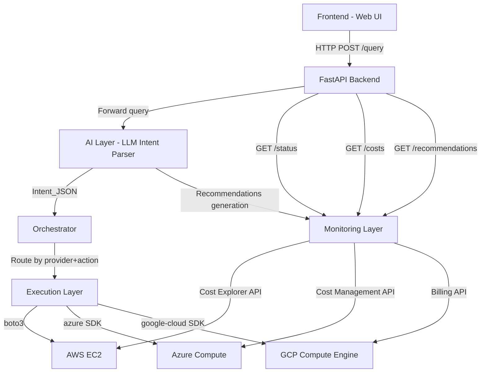
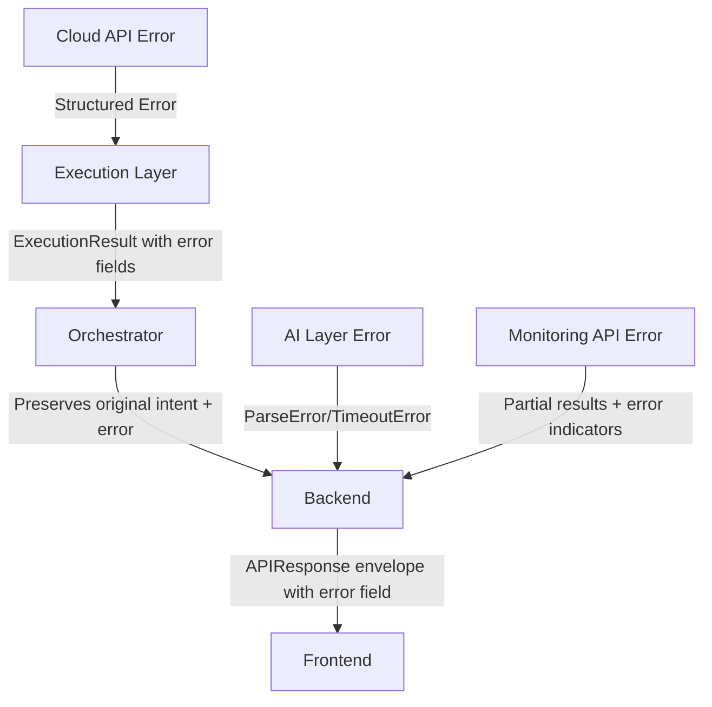

# Design Document: Multi-Cloud AIOps Platform

## Overview

The Multi-Cloud AIOps Platform enables users to manage cloud resources across AWS, Azure, and GCP through natural language queries. The system architecture separates concerns into distinct layers: a minimal web frontend for user interaction, a FastAPI backend for API routing, an LLM-based AI layer for intent parsing only, a custom orchestrator for deterministic action routing, cloud-specific execution functions, and a monitoring layer for cost/status tracking and recommendations.

The core design principle is that the LLM never executes actions directly. It only parses natural language into structured intent, which the orchestrator then routes to the appropriate cloud-specific function via a provider registry pattern.

### Key Design Decisions

1. **LLM as Parser Only**: The AI layer receives natural language and outputs structured JSON. It has no access to cloud APIs or execution capabilities.
2. **Provider Registry Pattern**: A dictionary mapping `(cloud_provider, action)` tuples to execution functions, enabling new providers without modifying routing logic.
3. **Common Abstract Interface**: All cloud providers implement the same Python ABC, ensuring uniform input/output contracts.
4. **Unified Response Format**: All cloud operations return responses in the same envelope structure regardless of provider.
5. **Separation of Monitoring from Execution**: Cost and status monitoring are handled by a dedicated layer independent of the execution path.

## Architecture



### Request Flow

1. User submits natural language query via Frontend
2. Backend receives query, validates input, forwards to AI Layer
3. AI Layer parses query into Intent_JSON (intent, cloud, action, conditions)
4. Backend passes Intent_JSON to Orchestrator
5. Orchestrator validates Intent_JSON, looks up `(cloud, action)` in provider registry
6. Orchestrator invokes the registered execution function
7. Execution function calls cloud API, returns unified response
8. Backend wraps response in envelope structure, returns to Frontend
9. Frontend displays structured result

### Monitoring Flow

1. User requests cost/status/recommendations via Frontend
2. Backend routes to Monitoring Layer
3. Monitoring Layer queries relevant cloud APIs
4. Results are normalized into unified format
5. For recommendations, AI Layer analyzes monitoring data and generates suggestions
6. Backend returns unified response to Frontend

## Components and Interfaces

### 1. Frontend (Web UI)

- **Technology**: Minimal HTML/JS or lightweight framework (React/Vue)
- **Responsibility**: Query input, result display, loading states, error handling
- **Endpoints consumed**: POST `/api/query`, GET `/api/status`, GET `/api/costs`, GET `/api/recommendations`

### 2. FastAPI Backend

- **Technology**: Python FastAPI
- **Responsibility**: API routing, input validation, CORS handling, response envelope wrapping, error translation
- **Exposed endpoints**:
  - `POST /api/query` — Submit natural language query
  - `GET /api/status` — Retrieve resource status
  - `GET /api/costs` — Retrieve cost data
  - `GET /api/recommendations` — Retrieve AI recommendations

### 3. AI Layer (Intent Parser)

- **Technology**: LLM API (OpenAI, Anthropic, or similar) wrapped in a Python service class
- **Responsibility**: Parse natural language into Intent_JSON. Generate recommendations from monitoring data.
- **Interface**:

```python
class AILayer:
    async def parse_intent(self, query: str) -> IntentJSON:
        """
        Parse a natural language query into structured intent.
        Raises: ParseError if intent cannot be determined.
        Raises: UnsupportedProviderError if provider not in {AWS, Azure, GCP}.
        Raises: QueryTooLongError if query exceeds 500 characters.
        """
        ...
    
    async def generate_recommendations(self, monitoring_data: MonitoringData) -> list[Recommendation]:
        """
        Generate cost optimization recommendations from monitoring data.
        Requires at least 24 hours of data.
        """
        ...
```

### 4. Orchestrator

- **Technology**: Custom Python logic
- **Responsibility**: Validate Intent_JSON, route to execution functions via provider registry, audit logging
- **Interface**:

```python
class Orchestrator:
    def __init__(self):
        self._registry: dict[tuple[str, str], Callable] = {}
    
    def register(self, provider: str, action: str, handler: Callable) -> None:
        """Register an execution function for a (provider, action) pair."""
        ...
    
    async def route(self, intent: IntentJSON) -> ExecutionResult:
        """
        Validate and route intent to the registered handler.
        Raises: UnsupportedProviderError, UnsupportedActionError, ValidationError.
        Logs intent_id, provider, action, timestamp before invocation.
        """
        ...
```

### 5. Execution Layer

- **Technology**: Cloud SDKs (boto3, azure-mgmt-compute, google-cloud-compute)
- **Responsibility**: Execute cloud-specific operations, return unified responses
- **Common Interface**:

```python
from abc import ABC, abstractmethod

class CloudProvider(ABC):
    @abstractmethod
    async def start_instance(self, params: dict) -> dict:
        """Start a cloud instance. Returns unified response dict."""
        ...
    
    @abstractmethod
    async def stop_instance(self, params: dict) -> dict:
        """Stop a cloud instance. Returns unified response dict."""
        ...
```

- **Implementations**:
  - `AWSProvider(CloudProvider)` — Uses boto3 for EC2 operations
  - `AzureProvider(CloudProvider)` — Uses azure SDK for VM operations
  - `GCPProvider(CloudProvider)` — Uses google-cloud SDK for Compute Engine operations

### 6. Monitoring Layer

- **Technology**: Cloud cost/monitoring APIs wrapped in Python service class
- **Responsibility**: Cost data retrieval, status monitoring, data normalization
- **Interface**:

```python
class MonitoringLayer:
    async def get_costs(self, time_period: Optional[TimePeriod] = None) -> list[CostEntry]:
        """Retrieve and normalize cost data from all providers."""
        ...
    
    async def get_resource_status(self, provider: Optional[str] = None) -> list[ResourceStatus]:
        """Retrieve current resource status from target provider(s)."""
        ...
    
    async def compare_costs(self, resource_type: str, time_period: TimePeriod) -> CostComparison:
        """Compare costs across providers for a resource type."""
        ...
```

## Data Models

### Intent_JSON

```python
from dataclasses import dataclass
from typing import Optional

@dataclass
class IntentJSON:
    intent: str          # Non-empty string describing the parsed intent
    cloud: str           # One of: "AWS", "Azure", "GCP"
    action: str          # Non-empty string describing the action (e.g., "start_instance")
    conditions: str      # Additional conditions/parameters (may be empty string)
```

### Execution Result (Unified Response)

```python
@dataclass
class ExecutionResult:
    success: bool
    provider: str                    # "AWS", "Azure", or "GCP"
    resource_id: str                 # Provider-specific resource identifier
    action: str                      # Action that was performed
    state: Optional[str]             # New state after action (e.g., "running", "stopped")
    error_code: Optional[str]        # Provider error code if failed
    error_message: Optional[str]     # Human-readable error description
    metadata: dict                   # Additional provider-specific details
```

### Cost Entry (Unified)

```python
@dataclass
class CostEntry:
    provider: str          # "AWS", "Azure", or "GCP"
    resource_type: str     # Normalized resource type
    cost_amount: float     # Cost in USD
    currency: str          # Always "USD" (normalized)
    period_start: str      # ISO 8601 date
    period_end: str        # ISO 8601 date
```

### Resource Status (Unified)

```python
@dataclass
class ResourceStatus:
    resource_id: str       # Provider-specific identifier
    provider: str          # "AWS", "Azure", or "GCP"
    state: str             # Normalized: "running", "stopped", or "terminated"
    cpu_utilization: Optional[float]  # 0.0-100.0 rounded to 1 decimal, or None
    cpu_available: bool    # Whether CPU metric was available
```

### Recommendation

```python
@dataclass
class Recommendation:
    action: str                # Recommended action description (≤500 chars)
    resource_id: str           # Target resource identifier
    provider: str              # Affected cloud provider
    estimated_saving: float    # Monthly saving in USD
    generated_at: str          # ISO 8601 timestamp
```

### API Envelope

```python
@dataclass
class APIResponse:
    status: str            # "success" or "error"
    data: Optional[Any]    # Response payload on success
    error: Optional[dict]  # Error details on failure: {field, message}
```

### Cost Comparison

```python
@dataclass
class CostComparison:
    resource_type: str
    period: TimePeriod
    cheapest_providers: list[str]  # One or more providers with lowest cost
    breakdown: list[CostEntry]     # Per-provider cost details
```

### Provider Registry Structure

```python
# Registry maps (provider, action) tuples to execution functions
# Example:
registry: dict[tuple[str, str], Callable] = {
    ("AWS", "start_instance"): aws_provider.start_instance,
    ("AWS", "stop_instance"): aws_provider.stop_instance,
    ("Azure", "start_instance"): azure_provider.start_instance,
    ("Azure", "stop_instance"): azure_provider.stop_instance,
    ("GCP", "start_instance"): gcp_provider.start_instance,
    ("GCP", "stop_instance"): gcp_provider.stop_instance,
}
```

## Correctness Properties

*A property is a characteristic or behavior that should hold true across all valid executions of a system — essentially, a formal statement about what the system should do. Properties serve as the bridge between human-readable specifications and machine-verifiable correctness guarantees.*

### Property 1: Whitespace query rejection

*For any* string composed entirely of whitespace characters (spaces, tabs, newlines, or empty string), the input validation layer SHALL reject it and prevent submission to the backend.

**Validates: Requirements 1.6**

### Property 2: Intent_JSON structural invariant

*For any* successfully parsed natural language query, the resulting Intent_JSON SHALL contain exactly four fields: `intent` (non-empty string), `cloud` (one of "AWS", "Azure", "GCP"), `action` (non-empty string), and `conditions` (string, may be empty).

**Validates: Requirements 2.1**

### Property 3: Intent_JSON round-trip

*For any* valid Intent_JSON object, serializing it to a string representation and then parsing it back SHALL produce an equivalent Intent_JSON object with identical field values.

**Validates: Requirements 2.5**

### Property 4: AI Layer input validation errors

*For any* natural language query that either references a cloud provider not in {"AWS", "Azure", "GCP"} or exceeds 500 characters in length, the AI Layer SHALL return an error response containing a message that identifies the specific validation failure (unsupported provider or length exceeded).

**Validates: Requirements 2.6, 2.7**

### Property 5: Orchestrator routes valid intents correctly

*For any* Intent_JSON whose `(cloud, action)` pair is present in the provider registry, the Orchestrator SHALL successfully route it to the exact execution function registered for that pair, without error.

**Validates: Requirements 3.1, 3.2**

### Property 6: Orchestrator rejects unregistered provider/action pairs

*For any* Intent_JSON whose `(cloud, action)` pair is NOT present in the provider registry, the Orchestrator SHALL return an error indicating the unsupported provider or action, and SHALL NOT invoke any execution function.

**Validates: Requirements 3.3**

### Property 7: Orchestrator rejects malformed intents

*For any* Intent_JSON that is missing required fields (empty cloud or empty action) or contains malformed data, the Orchestrator SHALL return a validation error and preserve the original intent data for audit purposes.

**Validates: Requirements 3.4**

### Property 8: Orchestrator audit logging

*For any* successfully routed intent, the Orchestrator SHALL emit an audit log entry containing the intent identifier, target cloud provider, action name, and timestamp, all recorded before the execution function is invoked.

**Validates: Requirements 3.6**

### Property 9: Dynamic provider registration and routing

*For any* new `(cloud_provider, action)` pair that is dynamically registered in the provider registry with a valid execution function, the Orchestrator SHALL successfully route subsequent intents for that pair without modification to existing routing logic.

**Validates: Requirements 3.7, 11.4**

### Property 10: Execution error response structure (cross-provider)

*For any* cloud API failure across AWS, Azure, or GCP, the Execution Layer SHALL return a structured error response containing the provider-specific error code, a human-readable error message, and the resource identifier that was targeted.

**Validates: Requirements 4.3, 5.3, 6.3**

### Property 11: Execution success response structure (cross-provider)

*For any* successful cloud operation across AWS, Azure, or GCP, the Execution Layer SHALL return a confirmation response containing the resource identifier and the new resource state, conforming to the common ExecutionResult interface.

**Validates: Requirements 4.4, 4.7, 5.4, 5.7, 6.4, 6.7**

### Property 12: AWS instance ID format validation

*For any* string that does not match the pattern `i-[0-9a-f]{1,17}`, the AWS Execution Layer SHALL reject it with a structured error indicating invalid instance ID format, without making any API call to AWS.

**Validates: Requirements 4.5**

### Property 13: Cost data normalization

*For any* cost data retrieved from any combination of AWS, Azure, and GCP providers, the Monitoring Layer SHALL normalize all currency values to USD and present results in the unified CostEntry format grouped by provider and resource type.

**Validates: Requirements 7.2**

### Property 14: Cheapest provider comparison

*For any* set of cost data across providers for a given resource type and time period, the Monitoring Layer SHALL correctly identify the provider(s) with the lowest total cost. If two or more providers have equal cost, all tied providers SHALL be returned.

**Validates: Requirements 7.3**

### Property 15: Cost time period filtering

*For any* cost query specifying a time period within the valid range (1 day to 12 months in the past), the Monitoring Layer SHALL return only cost entries whose period falls within the specified range, excluding all entries outside it.

**Validates: Requirements 7.4**

### Property 16: Partial provider failure resilience

*For any* monitoring query (cost or status) where a strict subset of provider APIs fail, the Monitoring Layer SHALL return valid data from the remaining responsive providers and include an error indicator identifying each failed provider by name.

**Validates: Requirements 7.6, 8.5**

### Property 17: Resource status unified structure

*For any* resource status response from any supported cloud provider, the Monitoring Layer SHALL return a ResourceStatus object containing: resource identifier (string), provider name (one of AWS/Azure/GCP), instance state (one of "running", "stopped", "terminated"), and CPU utilization (float 0.0-100.0 rounded to one decimal place, or null if unavailable with an availability indicator).

**Validates: Requirements 8.2, 8.3, 8.4**

### Property 18: Recommendation structure invariants

*For any* AI-generated recommendation, it SHALL contain: a natural language description of no more than 500 characters specifying the recommended action, a target resource identifier, an affected cloud provider, an estimated monthly saving as a monetary value, and a valid ISO 8601 timestamp indicating when it was generated. The total count of recommendations for any single request SHALL be between 1 and 50 inclusive.

**Validates: Requirements 9.1, 9.2, 9.5**

### Property 19: API envelope consistency

*For any* response returned by the Backend API (success or error), it SHALL conform to the envelope structure containing a `status` field (either "success" or "error"), a `data` field (present on success, null on error), and an `error` field (present on error, null on success).

**Validates: Requirements 10.6**

### Property 20: API validation error responses

*For any* API request that fails input validation, the Backend SHALL return HTTP 422 with a JSON body containing the name of the field that failed validation and a human-readable description of the violated rule.

**Validates: Requirements 10.5**

### Property 21: Downstream failure error responses

*For any* API request where a downstream service (AI Layer, Orchestrator, or Monitoring Layer) is unreachable or returns an error, the Backend SHALL return HTTP 502 with a JSON body identifying which specific service failed.

**Validates: Requirements 10.7**

### Property 22: CORS headers present

*For any* HTTP response returned by the Backend API, the response SHALL include CORS headers permitting requests from the web frontend origin.

**Validates: Requirements 10.8**

## Error Handling

### Error Categories

| Category | HTTP Code | Trigger | Response |
|----------|-----------|---------|----------|
| Input Validation | 422 | Missing/invalid request fields, empty query, query too long | Field name + validation rule description |
| Unsupported Provider | 400 | Cloud provider not in registry | Provider name + list of supported providers |
| Unsupported Action | 400 | Action not registered for provider | Action name + list of available actions |
| Cloud API Error | 500 | AWS/Azure/GCP API returns error | Provider error code + message + resource ID |
| Auth Failure | 502 | Cloud credentials expired/invalid | Provider + subscription/project ID |
| Service Unavailable | 502 | AI Layer or downstream service unreachable | Service name + failure reason |
| Timeout | 504 | Operation exceeds time limit | Operation name + timeout duration |
| Not Found | 404 | Non-existent endpoint | Endpoint path |

### Error Propagation Strategy



### Error Design Principles

1. **Never swallow errors**: Every error propagates up with context preserved
2. **Structured errors only**: All errors follow the APIResponse envelope
3. **Partial success allowed**: Monitoring queries return available data even when some providers fail
4. **Original data preserved**: On failure, the user's original query text is always available for retry
5. **Specific identification**: Error responses identify exactly which component/provider/field failed
6. **No retry at execution layer**: Cloud API errors are returned immediately; retry logic is the caller's responsibility

## Testing Strategy

### Unit Tests

Unit tests cover specific examples, edge cases, and component contracts:

- **AI Layer**: Test parsing of specific query examples (start/stop/manage for each provider), error cases (unparseable queries, unsupported providers)
- **Orchestrator**: Test routing for each registered (provider, action) pair, validation rejection for specific malformed intents
- **Execution Layer**: Test with mocked cloud SDKs for success/failure scenarios, instance-already-in-state handling
- **Monitoring Layer**: Test cost normalization with specific currency conversion examples, default time period behavior
- **API Layer**: Test each endpoint with valid/invalid requests, verify HTTP status codes and response structure

### Property-Based Tests

Property-based tests verify universal invariants using randomized inputs (minimum 100 iterations per property):

- **Library**: [Hypothesis](https://hypothesis.readthedocs.io/) (Python PBT framework)
- **Each property test references its design property number**
- **Tag format**: `Feature: multi-cloud-aiops-platform, Property {N}: {title}`

Key property test groups:
1. **Intent Parsing** (Properties 1-4): Generate random queries, whitespace strings, oversized strings, and Intent_JSON objects to validate parsing invariants and round-trip
2. **Orchestrator Routing** (Properties 5-9): Generate random (provider, action) pairs (both valid and invalid), malformed intents, and dynamic registrations
3. **Execution Layer** (Properties 10-12): Generate random error codes, success states, and instance ID strings to validate response structure and format validation
4. **Monitoring** (Properties 13-17): Generate random cost entries with various currencies, time periods, provider failures, and resource statuses
5. **Recommendations** (Property 18): Generate random monitoring datasets, verify output constraints
6. **API Layer** (Properties 19-22): Generate random API responses, invalid requests, and downstream failures to verify envelope consistency and error handling

### Integration Tests

Integration tests verify end-to-end wiring with mocked cloud services:

- Full request flow: query → parse → route → execute → response
- Monitoring flow: query → retrieve → normalize → respond
- Provider API failures and timeout handling
- CORS header verification
- Frontend-to-backend communication

### Test Organization

```
tests/
├── unit/
│   ├── test_ai_layer.py
│   ├── test_orchestrator.py
│   ├── test_execution_aws.py
│   ├── test_execution_azure.py
│   ├── test_execution_gcp.py
│   ├── test_monitoring.py
│   └── test_api.py
├── property/
│   ├── test_intent_properties.py
│   ├── test_orchestrator_properties.py
│   ├── test_execution_properties.py
│   ├── test_monitoring_properties.py
│   ├── test_recommendation_properties.py
│   └── test_api_properties.py
└── integration/
    ├── test_full_flow.py
    ├── test_monitoring_flow.py
    └── test_error_handling.py
```

